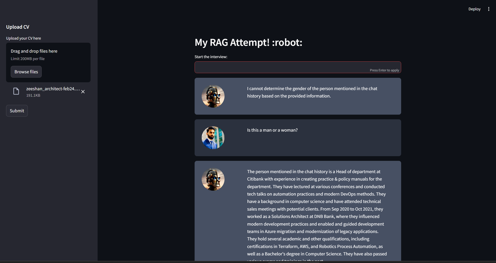

# My RAG (Retrieval-Augmented Generation) Attempt

This project is a Streamlit-based application that implements a Retrieval-Augmented Generation (RAG) system. It allows users to upload PDF documents (such as CVs), processes the text, and then performs question-answering using a conversational AI model.

## Features

- **PDF Upload**: Users can upload multiple PDF files.
- **Text Processing**: Extracts text from the uploaded PDFs and splits it into manageable chunks.
- **Vector Store Creation**: Converts text chunks into vector embeddings using HuggingFace's Instruct Embeddings.
- **Conversational AI**: Implements a conversation chain that retrieves relevant information from the text chunks and generates responses using a pre-trained model hosted on HuggingFace.
- **Memory Management**: The application maintains conversational context using a buffer memory.

## Installation

To run this project locally, follow these steps:

1. **Clone the repository**:
   ```bash
   git clone <your-repository-url>
   cd <repository-directory>
   ```

2. **Install the required dependencies**:
   ```bash
   pip install -r requirements.txt
   ```

3. **Create a virtual environment** (optional but recommended):
   ```bash
   python -m venv venv
   source venv/bin/activate
   ```

4. **Ensure that the `.env` file contains any API keys** needed for models from HuggingFace or OpenAI.

5. **Start the Streamlit application**:
   ```bash
   streamlit run app.py
   ```

6. **Access the application**:
   Open your web browser and go to `http://localhost:8501` to access the Streamlit application.

7. **Upload PDF files**:
   In the application, click on the "Upload PDF" button to select and upload one or multiple PDF files.

8. **Interact with the conversational AI**:
   Once the PDF files are uploaded and processed, you can ask questions and interact with the conversational AI model.

9. **Manage conversational context**:
   The application maintains conversational context using a buffer memory, allowing you to have multi-turn conversations.

10. **Stop the application**:
    To stop the Streamlit application, press `Ctrl + C` in the terminal where it is running.

That's it! You can now explore and use the Retrieval-Augmented Generation (RAG) system implemented in this Streamlit application.


### Instructions:

- **Ensure that the `.env` file contains any API keys** needed for models from HuggingFace or OpenAI.


